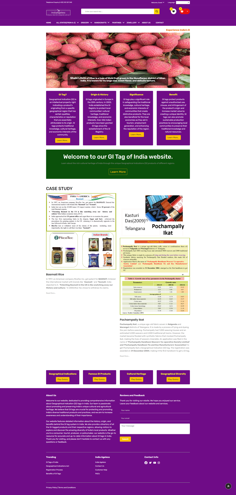

# India_Ageless
This project (India Ageless) based on the GI tag of India should aim to promote awareness, appreciation, and understanding of Indian products and their unique qualties...
This project consists technologies like HTML, CSS, JavaScript, Python and Django.
 
# Abstraction/Overview
- This project (India Ageless) based on the GI tag of India should aim to promote awareness, appreciation, and understanding of Indian products and their unique qualities.
- By including features and functionalities that cater to diverse user needs and interests and enable users to explore and purchase GI tagged products, as well as learn about their history and significance, the website can support local businesses and artisans, and promotes awareness and appreciation of Indian culture and heritage and also leads the economic development of our country.
# Features
1.	Database of GI tagged products
2.	Definition and purpose
3.	History and evolution
4.	List of GI tagged products
5.	Geographic mapping
6.	Educational resources
7.	Online marketplace
8.	Benefits of GI tag
9.	Search functionality
10.	Multilingual support
11.	Device responsiveness
12.	Case studies and success stories
13.	FAQ and resources
14.	User-generated content
15.	Social media integration
16.	Interactive tools and multimedia
17.	Video Introduction
18.	User-generated content
19.	Feedback and support
    
- Overall, this project (India Ageless) based on the GI tag of India should aim to promote awareness, appreciation, and understanding of Indian products and their unique qualities.
- By including features and functionalities that cater to diverse user needs and interests and enable users to explore and purchase GI tagged products, as well as learn about their history and significance, the website can help support local businesses and artisans, and promotes awareness and appreciation of Indian culture and heritage.

   

